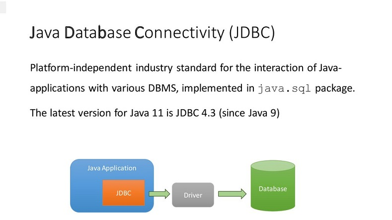
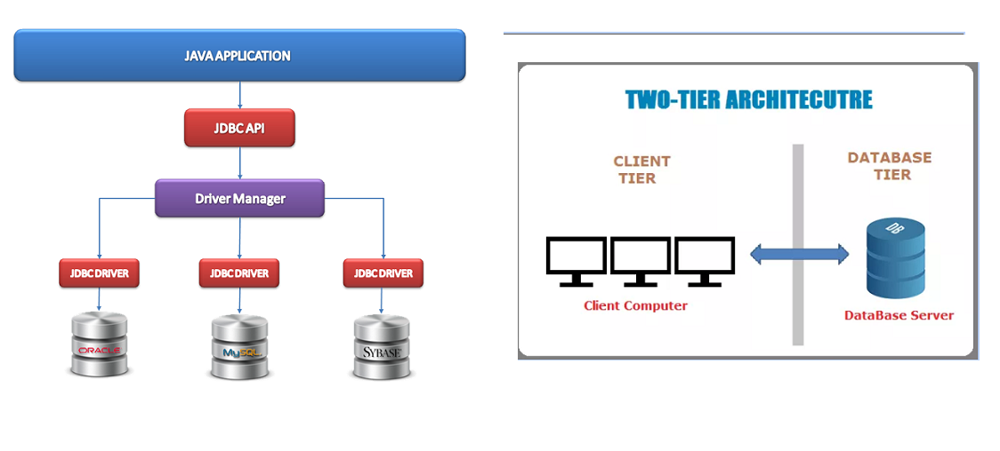
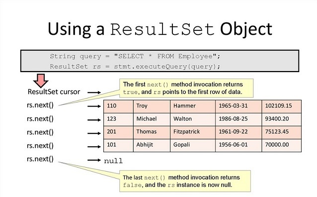
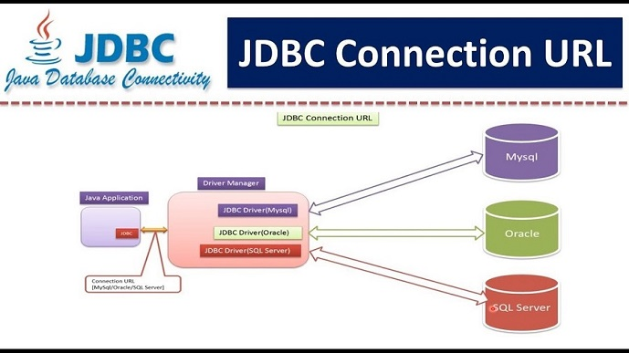

# JDBC

       
<h3> Qu'est-ce que JDBC </h3>
Dans la plupart des applications Java, il est toujours nécessaire d'interagir avec les bases de données pour récupérer, manipuler et traiter les données. À cette fin, Java JDBC a été introduit.
JDBC est la forme courte couramment utilisée pour la connectivité de base de données Java. En utilisant JDBC, nous pouvons interagir avec différents types de bases de données relationnelles telles qu'Oracle, MySQL, MS Access, mariaDB etc.

Avant JDBC, l'API ODBC a été introduite pour se connecter et effectuer des opérations avec la base de données. ODBC utilise un pilote ODBC qui dépend de la plate-forme car il a été écrit en langage de programmation C. L'API JDBC est écrite en langage Java, est indépendante de la plate-forme et rend elle-même indépendante de la plate-forme Java.

   
      

<B>Java doit être installé </B>sur le système sur lequel vous souhaitez créer l'application Java et utiliser JDBC.

 
<b>deux. Vous devez disposer des fichiers jar du pilote JDBC </b>appropriés pour vous connecter au SGBD.Chaque base de données possède différents   fichiers jar de pilote JDBC.   
*    

 <h3> 4. Lecture du résultat</h3>
On obtient un objet ResultSet le plus souvent en invoquant la méthode executeQuery(String) d'un objet Statement. Un ResultSet peut être vu comme un tableau de résultats, dont chaque colonne est un champ, et chaque ligne un enregistrement. La lecture des lignes d'un ResultSet se fait au travers d'un curseur, que l'on peut déplacer ligne par ligne. Lors que l'on obtient un objet ResultSet, par exécution de la méthode executeQuery(String), ce curseur est positionné sur une ligne virtuelle, qui se trouve avant la première ligne du tableau. La première catégorie de méthodes proposées par l'interface ResultSet va donc nous permettre de déplacer le curseur dans ce tableau....

 
